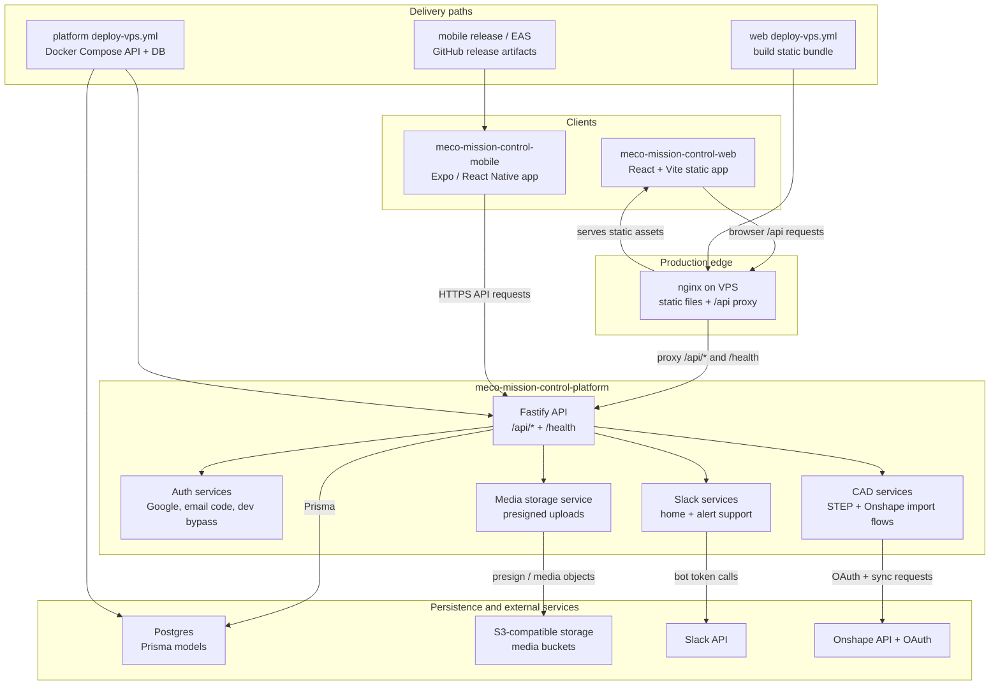

# Mission Control Cross-Repo Architecture

This document shows how the Mission Control web, mobile, platform, data stores,
integrations, and deployment paths fit together. It is a repo-local reference
for cross-repo planning and release reviews.

## System Diagram

## Repo Responsibilities

`meco-mission-control-web` owns the broad-screen Mission Control workspace. It
serves dense planning, review, robot configuration, inventory, roster, reports,
help, and mentor/admin workflows. In production it is built into static assets
and served by nginx on the VPS.

`meco-mission-control-mobile` owns the faster in-shop update surface. It consumes
the same platform bootstrap and mutation contracts for task, worklog,
attendance, manufacturing, inventory, QA, and auth flows. It ships through the
mobile release/EAS path, not through the production VPS web deploy.

`meco-mission-control-platform` owns persistence, auth, validation, API routes,
bootstrap payloads, integrations, and production database behavior. The platform
is the source of truth for permissions and data contracts even when a client
hides or pre-validates a control.

## Branch And Promotion Architecture

`development` is the active integration branch for normal feature and fix work.
When release audit or stabilization needs a frozen candidate, cut `staging` or a
named `staging/*` branch from the current `development` head and use that branch
as the `main` PR source. Treat staging branches like stashes: they preserve a
candidate snapshot while regular development continues separately, and they
should change only through an intentional refresh from `development` or through
`fix/*` or `hotfix/*` stabilization PRs.

Production `main` promotions may come from `staging`, `staging/*`,
`development`, or `hotfix/*`. A `staging`-sourced main PR should validate the
same staging branch across web, platform, and mobile; a direct `development`
promotion validates the integration branch across the repo family. Staging is a
branch/audit concept only and does not imply a second live VPS or mobile runtime.

## Client To Platform Flow

The web app uses `/api` as its default API base. Local development proxies that
path through Vite to a platform instance, usually `http://localhost:8080`.
Production nginx serves the web bundle and proxies `/api/*` and `/health` to the
platform service on `127.0.0.1:8080`.

The mobile app resolves its platform base URL from Expo public configuration and
talks directly to the platform API. Android emulator development may use
`10.0.2.2` to reach a backend running on the host machine.

Both clients depend on `GET /api/auth/config`, auth sign-in endpoints, and
`GET /api/bootstrap` for initial workspace hydration. Mutating flows should post
or patch through platform endpoints and then refresh or reconcile from the
platform-confirmed state.

## Platform To Persistence And Integrations

The platform stores durable production data in Postgres through Prisma. Runtime
stores still exist for selected tests and compatibility paths, but production
features that must survive restart should use persisted models.

S3-compatible storage is used for media upload flows through presigned URLs.
Bucket naming is derived from configured bucket prefix/team context, and clients
should never receive raw storage credentials.

Slack integration is platform-owned. Slack bot tokens, channel IDs, usergroups,
and alert behavior remain server-side configuration and should not be exposed to
web or mobile clients.

Onshape integration is also platform-owned. OAuth credentials, saved document
references, sync budgeting, import normalization, and CAD-derived record
creation belong behind platform routes. Clients should present connection,
preview, and finalization state without handling Onshape secrets.

## Deployment Paths

The web deploy path builds the Vite app, snapshots the production static bundle,
syncs files to `/opt/pm-web/site`, and reloads nginx. Rollback uses retained web
bundle backups under `/opt/pm-backups/web`.

The platform deploy path builds and tests the Fastify API, syncs source to
`/opt/pm-server`, writes production environment content from GitHub secrets,
starts Docker Compose, applies Prisma state, and checks `/health`. Platform
deploys create file, env, and database backup artifacts under
`/opt/pm-backups/server`.

The mobile release path is separate from the VPS. Mobile releases use the mobile
repo release/EAS configuration and should coordinate with platform contract
changes before app distribution.

## Cross-Repo Change Checklist

Use this checklist when a change crosses repo boundaries:

- Platform route or payload changed: update platform route tests,
  `docs/api-reference.md`, web types/normalization, and mobile domain types.
- Bootstrap shape changed: run platform contract verification and update web or
  mobile bootstrap handling in the same release path.
- Auth behavior changed: verify web session expiry handling and mobile auth
  error states.
- Deployment behavior changed: update the owning repo release/runbook docs and
  confirm rollback assumptions.
- Integration behavior changed: keep secrets server-side and document visible
  client states separately from platform credential handling.

## Related Docs

- Web: `README.md`, `docs/CURRENT_WEB_SPEC.md`,
  `docs/release-readiness-checklist.md`.
- Platform: `docs/backend-overview.md`, `docs/api-reference.md`,
  `docs/platform-deployment-recovery.md`,
  `docs/production-smoke-test-checklist.md`.
- Mobile: `docs/overview.md`, `docs/api-integration.md`,
  `docs/mobile-contributor-guide.md`, `docs/release.md`.
