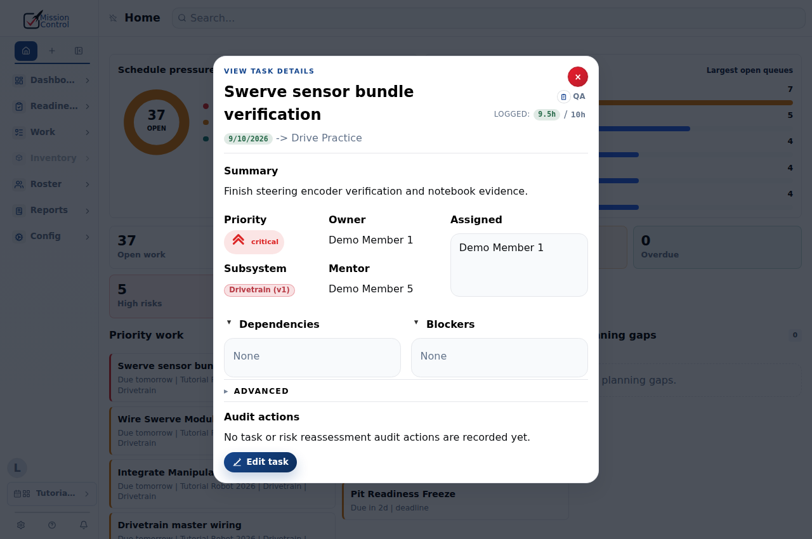
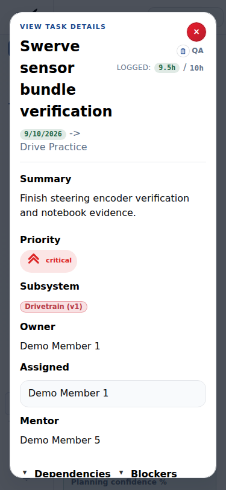

# UI audit corrections — 2026-09-09

- [x] **W1 — Browser magnification:** removed workspace-wide keyboard, wheel and gesture cancellation from `src/app/hooks/workspace/derived/useAppWorkspaceGlobalEffects.ts`. The workspace now leaves browser zoom available.
- [x] **W2 — Dialog accessibility:** `src/components/ModalDialog.tsx` uses native `showModal`/`close` for initial focus, background inertness, Escape and return focus. Replaced repeated scrims in task, material, structure, report, manufacturing, purchase, roster, risk, milestone, meeting, season and project dialogs. Every modal has an accessible name. Nested menus/reveals portal into their owning dialog. Notifications and tutorial controls follow the active modal using `src/components/useModalPortalTarget.ts`; they return to the page when it closes. Removed superseded window Escape handlers.
- [x] **W3 — Reduced motion:** workspace tab and timeline period transitions honor `prefers-reduced-motion` in `src/app/styles/shell/layout/motion-a.css` and `motion-b/b.css`. Changes display immediately; loading/status information remains available.
- [x] **Shared contract:** bootstrap artifact and `ReportRecord` retain mobile QA evidence and request provenance. The canonical platform workflow command is consumed by mobile; web report CRUD retains its existing semantics.

The native dialog primitive replaces repeated custom modality rather than introducing a focus-trap library. Existing styles and editor content remain the visual authority. No database reset, reseed, discarded state or deployment is required.

## Validation

Chromium component integration probes verified uncancelled zoom events, named open dialogs, background inertness, menu Escape without closing the parent, nested-dialog Escape and focus restoration, visible/dismissible save-error notifications, tutorial continuation inside a modal, and notification reparenting after close. Reduced-motion mode computes no tab animation. The material dialog has no horizontal overflow at 375px and 1280px.

The running worktree application opened a real task-details dialog, focused within it, closed with Escape, produced no page errors, and had no document overflow at 375px. These screenshots show the inspected task view:

Canonical verification passed: 535 Jest tests, 11 workflow tests, contract comparison, TypeScript, ESLint and production build. Existing Node/Jest infrastructure includes a regression check for magnification events and QA evidence/provenance normalization. Browser probes were one-off diagnostics, not a new testing framework.

Not tested: physical devices, Safari/Firefox, VoiceOver/TalkBack, exhaustive contrast measurements or all authenticated editor workflows. The native mobile work has separate validation evidence in its repository.
